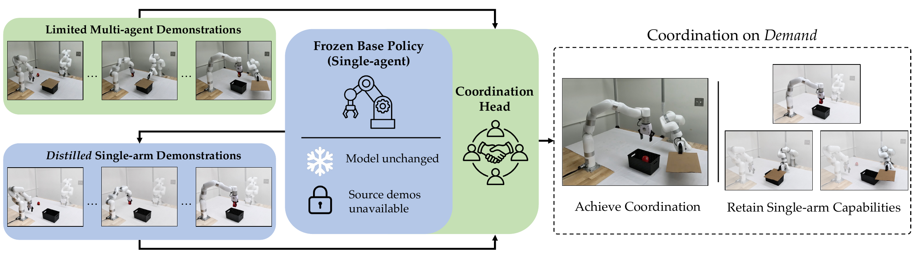

# ALTER: Residual Denoising Enables Sample-Efficient Multi-Agent Coordination on Demand

**Dayi Dong, Maulik Bhatt, Aayushi Shrivastava, Lasse Peters, Negar Mehr**<br>
University of California, Berkeley

**ALTER** stands for **A**daptation from **L**imited demonstrations for **T**eam
coordination with **E**xisting-skill **R**etention. It adapts pretrained diffusion
policies to coordinate with other robots while retaining their original
independent skills. A trainable residual coordination head corrects a frozen
base policy using limited collaborative demonstrations and single-agent replay
distilled from the base policy itself.

**[Paper](https://arxiv.org/abs/2609.32129)** ·
**[Project website](https://iconlab.negarmehr.com/ALTER/)**



## Website

The project website is published from [`docs/`](docs/). The website and supporting
media are preserved alongside the research code in this repository.

## Citation

If you find ALTER useful in your research, please cite:

```bibtex
@article{dong2026alter,
  title={Residual Denoising Enables Sample-Efficient Multi-Agent Coordination on Demand},
  author={Dong, Dayi and Bhatt, Maulik and Shrivastava, Aayushi and Peters, Lasse and Mehr, Negar},
  journal={arXiv preprint arXiv:2609.32129},
  year={2026},
  url={https://arxiv.org/abs/2609.32129}
}
```

## Simulation code release

The simulation code is available on the public repository’s `main` branch. Simulation checkpoints and data
are public at [ALTER-models](https://huggingface.co/Berkeley-ICON-Lab/ALTER-models)
and [ALTER-data](https://huggingface.co/datasets/Berkeley-ICON-Lab/ALTER-data).
Original code/checkpoints use Apache-2.0; original datasets use CC BY 4.0.
See [LICENSE](LICENSE) and [NOTICE](NOTICE) for source scope. Hardware checkpoints,
recordings and prepared training caches are available under `hardware/v1/` in the
same Hub repositories; use the separate [hardware guide](documentation/release/hardware.md)
and `release/hardware-manifest.json`. Physical operation still requires the
private external robot-control package.
Start with [installation](documentation/release/installation.md),
[artifact integrity/downloads](documentation/release/artifacts.md),
[simulation workflows](documentation/release/simulation.md), and
[hardware preparation](documentation/release/hardware.md).
[Licensing review](documentation/release/licensing.md) and
[Hugging Face publication](documentation/release/huggingface.md) describe the
release scope and verification. Local smoke tests do not reproduce the paper tables.
